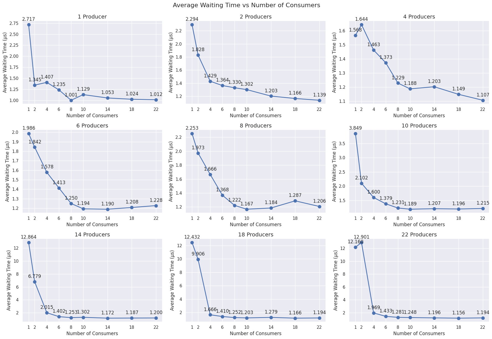

# producer-consumer
The producer consumer problem is a classic synchronization problem in computer science. It involves
two types of processes: producers, which generate data and place it into a buffer, and consumers, which
take data from the buffer. 

This repository contains a modification of the source code from _Andrae Muys_ to implement the producer-consumer problem using a queue that takes in a function (e.g. calculate_sine) and an array of arguments (e.g. 10 angles).

Our goal is to **find the optimal number of consumers** to use for a given producer. This will be done based on the
average waiting time in the queue.

### Benchmarks

For more information, read the report in `docs/report.pdf`.